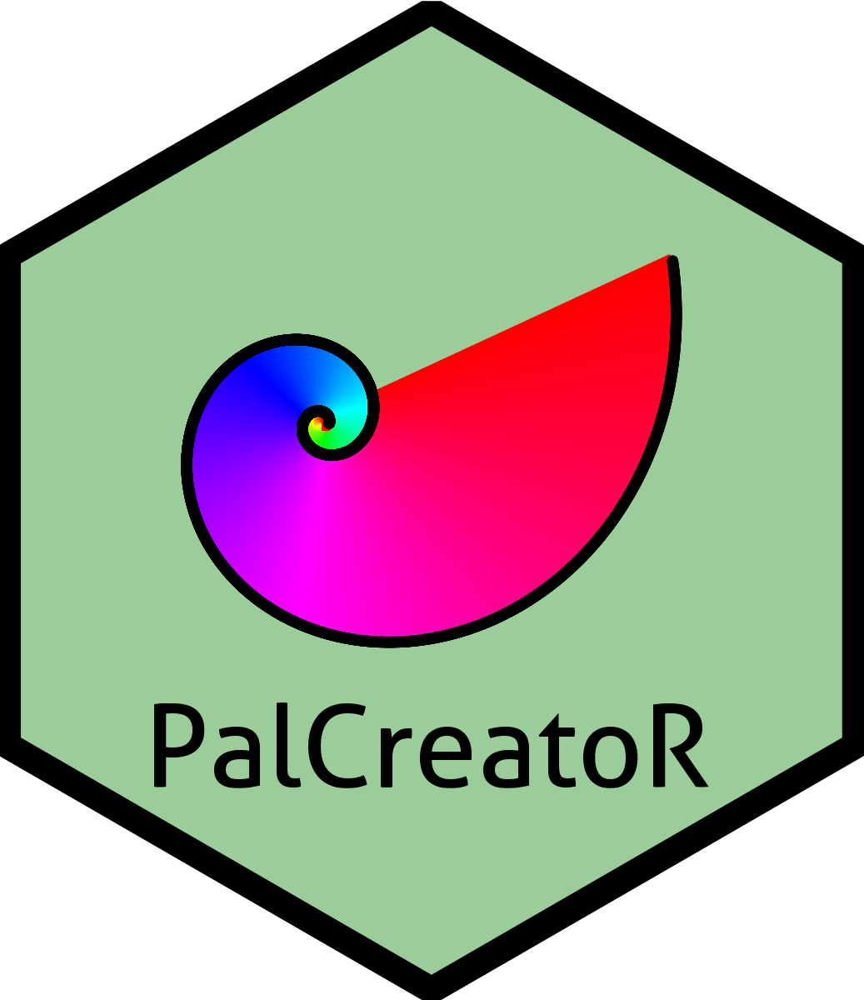

```{r load_packages, message=FALSE, warning=FALSE, include=FALSE} 
library(fontawesome)

```


<!--------------- Define the style ------------------>
<link rel="stylesheet" href="https://cdn.jsdelivr.net/gh/jpswalsh/academicons@1/css/academicons.min.css">

<style>
.Section_link{
  background-color: #4CAF50;
  border: none;
  border-radius: 15px;
  color: white;
  text-align: center;
  text-decoration: none;
  display: inline-block;
  font-size: 20px;
  width: 180px;
  height: 50px;
  line-height: 2em;
  margin-right: 5%;
  margin-left: 5%;
  font-family: "Open Sans";
}

.External_link{
  border-radius: 5px;
  border: none;
  text-align: center;
  text-decoration: none;
  display: inline-block;
  width: 60px;
}

h1 {text-align: center !important; 
   font-weight: bold !important; 
   font-size: 42px !important}
   
:target {
    display: block;    
    position: relative;     
    top: -150px;
    visibility: hidden;
}
</style>


<!--------------- Section link and buttons ------------------>
<div style="text-align: center">
  <a class="Section_link btn btn-primary btn-outline btn-xs" href="#Journal Articles">
    Journal Articles
  </a>
    <a class="Section_link btn btn-primary btn-outline btn-xs" href="#R Packages">
    R Packages
  </a>
    <a class="Section_link btn btn-primary btn-outline btn-xs" href="#Others">
    Others
  </a>
</div>

<br>

<div style="font-size: 100px; text-align: center">
<a href="https://orcid.org/0000-0002-6607-4382" target="_blank" style="color: #A6CE39; margin-right: 2.5%; margin-left: 2.5%;"><i class="ai ai-orcid ai"></i></a>
<a href=# target="_blank" style="color: black; margin-right: 2.5%; margin-left: 2.5%;"><i class="ai ai-google-scholar ai"></i></a>
</div>

<br>
<br>
<a id="Journal Articles">
</a>


<!--------------- Publications ------------------>
# Journal Articles
<div style="height: 1em;"></div>

## 2021
<!-- <p><b><u>Warton, D. I.</u></b>, and F. K. C. Hui. 2011. The arcsine is asinine: The analysis of proportions in ecology. Ecology 92:3–10. (For Testing Only!!!)</p> -->
<!-- <a class="External_link btn btn-primary btn-outline btn-xs" href=# target="_blank">Link</a> -->
<!-- <a class="External_link btn btn-primary btn-outline btn-xs" href=# target="_blank">GitHub</a> -->

<!-- <br> -->

<!-- <p><b><u>Post, D. M.</u></b> 2002. USING stable isotopes to estimate trophic position: MODELS, methods, and assumptions. Ecology 83:703–718. (For Testing Only!!!)</p> -->
<!-- <a class="External_link btn btn-primary btn-outline btn-xs" href=# target="_blank">Link</a> -->
<!-- <a class="External_link btn btn-primary btn-outline btn-xs" href=# target="_blank">GitHub</a> -->

<br>
<br>


<a id="R Packages"> </a>

# R Packages
<div style="height: 1em;"></div>

<div style="display: flex;">
<a href="https://genchanghsu.github.io/PalCreatoR/" target="_blank">  </a>
<div style="padding-left: 40px; padding-top: 0.2em;">
<p target="_blank"><b><u>Gen-Chang Hsu</u></b> and William Ou (2021). PalCreatoR: Create your own R palette using colors extracted from your favorite image. R package version 0.2.0. <a href="https://github.com/GenChangHSU/PalCreatoR" target="_blank">https://github.com/GenChangHSU/PalCreatoR</a>
</div>
</div>

<br>
<br>


<a id="Others"> </a>

# Others
<div style="height: 1em;"></div>

<br>
<br>
<br>
<br>
<br>

