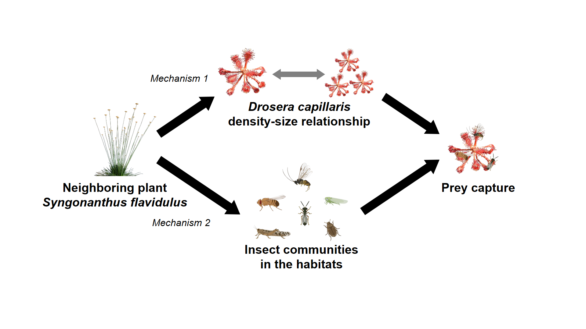

# Non-carnivorous neighbors influence prey capture by carnivorous plants via changes in density and size

 

## Project Summary

Plant carnivory represents one of the most fascinating ecological interactions on earth where plants attract and digest animal prey to meet nutrient demands. These prey-derived nutrients allow carnivorous plants to overcome nutrient limitation in the soil, and the ability to capture prey is fundamental to the fitness of carnivorous plants. Prey capture by carnivorous plants is influenced by many factors, including environmental conditions, morphological and chemical features of the traps, and even biotic interactions with other animals. However, little is known about how interactions with heterospecific plant neighbors may affect prey capture.

The pink sundew *Drosera capillaris* is commonly found in seasonal pond habitats in Florida. Also growing in these habitats is the yellow hatpins *Syngonanthus flavidulus*, the dominant neighboring plant species that flowers during the growing season of pink sundew. This provided us with a great opportunity to answer the question: how does the heterospecific non-carnivorous neighbor yellow hatpins influence prey capture by the carnivorous sundew? 

We tested two non-mutually exclusive mechanisms by which the neighboring yellow hatpins may influence prey capture by sundew (see the figure below). 
**Mechanism 1**: Yellow hatpins may affect prey capture by mediating the density and size of sundew. We expected a trade-off relationship between sundew density and size, with less dense but larger-sized sundew individuals capturing more prey items and vice versa.
**Mechanism 2**: Yellow hatpins may influence prey capture by changing the surrounding insect communities and thus prey availability. Specifically, the flowerheads of yellow hatpins may attract more insects to the surroundings, therefore leading to higher prey capture by sundew.

We surveyed sundew density, size (rosette diameter), and prey capture, along with insect communities, across habitat patches with varying yellow hatpins densities. We also experimentally removed the flowerheads of yellow hatpins to examine the effect of neighboring plant flowers on prey availability.

We found that sundew density was negatively associated with yellow hatpins density. Moreover, the sundew size decreased with increasing intraspecific density, resulting in high densities of smaller-sized sundew individuals in the habitat with few yellow hatpins and low densities of larger-sized sundew individuals in the habitat with abundant yellow hatpins. Such variation in sundew density and size in turn influenced its prey capture: sundew individuals (low densities but larger sizes) that grew in the habitat with high yellow hatpins densities captured more prey items per rosette area (**Mechanism 1** supported). Interestingly, we found no differences in the insect abundance or composition among habitats with varying yellow hatpins densities. Furthermore, experimental removal of neighboring plant flowerheads did not alter prey availability compared to the unmanipulated habitats, suggesting flowerhead attraction did not alter the local prey resource pool for sundew (**Mechanism 2** not supported).

Overall, our results highlight the role of interspecific and intraspecific interactions in mediating prey capture in carnivorous plants. Interspecific interactions with non-carnivorous neighbors can lead to higher prey capture, potentially by reducing intraspecific competition through changes in conspecific density and size. As higher prey resource inputs increase the trap size and seed production of carnivorous plants, this suggests that neighboring plants may confer fitness benefits to the co-occurring carnivores via increased prey capture. Importantly, this study provides novel insights into how interspecific interactions with heterospecific non-carnivorous neighbors, and intraspecific interactions among conspecific individuals, may together shape prey capture by carnivorous plants.

 

## Publication

<b><u>Hsu, G-C.</u></b>, D.F. Petticord, K.F. Slimon, and J.P. Sparks. 2025. Heterospecific-neighbor-mediated changes in density and size increase prey capture by a carnivorous plant. <i>*Oikos*</i>. (accepted)

<!-- <a class="External_link btn btn-primary btn-outline btn-xs" href="https://doi.org/10.1101/2022.01.31.478501" target="_blank">Preprint</a> -->
<!-- <a class="External_link btn btn-primary btn-outline btn-xs" href="https://github.com/GenChangHSU/2022_Earthworm_Stable_Isotope_Niche" target="_blank">GitHub</a> -->

